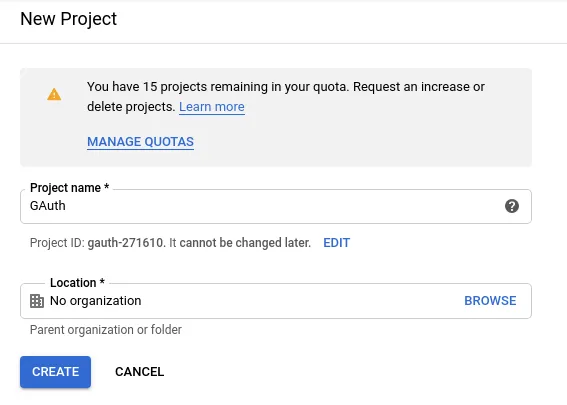
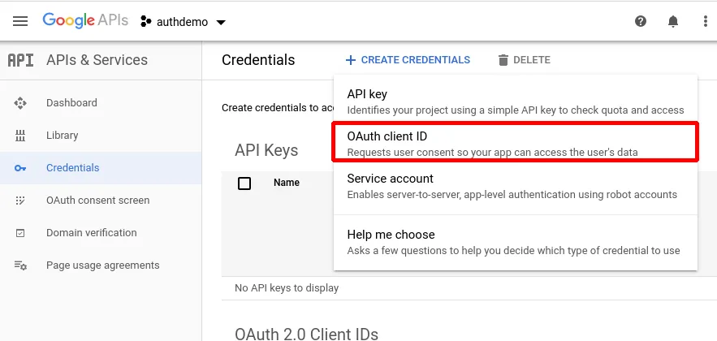
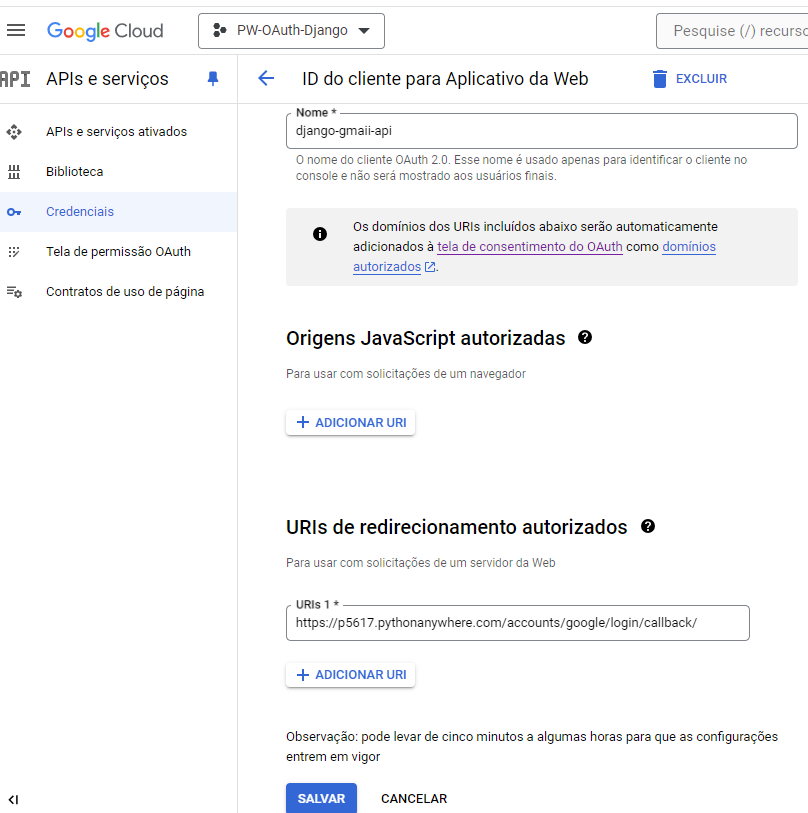
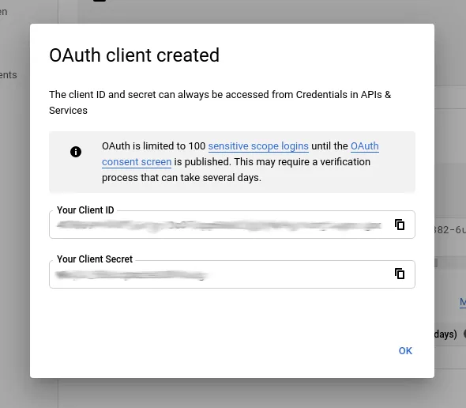
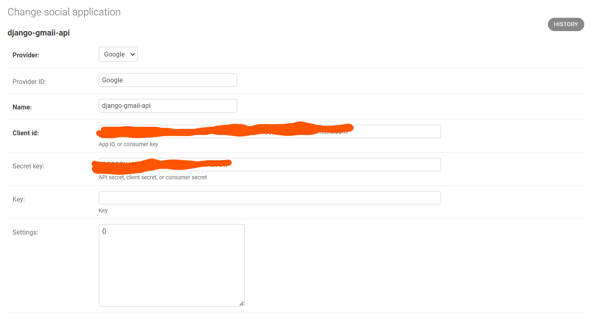
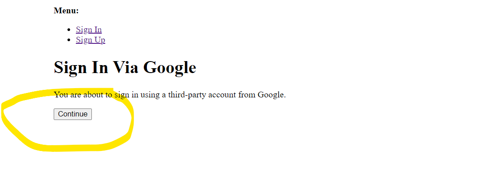

Universidade Lusófona
**Programação Web**

# TPC teórico: Autenticação via OAuth (Social Login)

Este TPC teórico deverá ser entegue até dia 31 de maio.

### Objetivo:
* Familiarizar-se com a autenticação usando social login como o Google
* familiarizar-se com o conceito de autenticação via OAuth 2.0.

### Recomendações:
* ver o video o seguinte [video](https://www.youtube.com/watch?v=ZV5yTm4pT8g) para se famializarem com o conceito de OAuth.
* ver a documentação da biblioteca [allauth](https://docs.allauth.org/en/latest/installation/quickstart.html).

### OAuth 2.0: Uma Visão Geral

OAuth 2.0 é um protocolo de autorização amplamente utilizado em aplicações web que visa  permitir que os utilizadores concedam acesso a suas informações em um serviço em particular (como uma rede social ou um serviço de armazenamento em nuvem) a terceiros, sem compartilhar suas credenciais de login.

## Como Funciona?

1. **Solicitação de Autorização**: O cliente (aplicação que deseja aceder ao dados do utilizador) solicita permissão para aceder aos recursos protegidos em nome do utilizador.

2. **Redirecionamento para o Fornecedor de Serviços de Autorização (AS)**: O utilizador é redirecionado para o servidor de autorização, onde ele pode fazer login e conceder permissões ao cliente.

3. **Concessão de Autorização**: O utilizador fornece consentimento para que o cliente aceda ao seus dados.

4. **Obtenção do Código de Autorização**: Após a concessão de autorização, o AS fornece ao cliente um código de autorização.

5. **Troca de Código por Token de Acesso**: O cliente troca o código de autorização por um token de acesso válido.

6. **Acesso a Recursos Protegidos**: O cliente usa o token de acesso para aceder os recursos protegidos em nome do utilizador.

## Componentes Principais

- **Cliente**: Aplicação que solicita acesso aos recursos protegidos do utilizador.
- **Servidor de Autorização (AS)**: Responsável por autenticar o utilizador e conceder tokens de acesso.
- **Proprietário do Recurso**: utilizador que possui os recursos protegidos.
- **Servidor de Recursos (RS)**: Onde os recursos protegidos estão localizados e acedidos pelo cliente.

## Benefícios do OAuth 2.0

- **Segurança**: As credenciais do utilizador não são partilhadas com o cliente.
- **Controle do Usuário**: Os utilizador têm controle sobre quais dados são acedidos pelo cliente.
- **Facilidade de Integração**: Facilita a integração entre diferentes aplicações e serviços.

O OAuth 2.0 é amplamente adotado na indústria e fornece uma estrutura segura e flexível para autenticação e autorização na web.


# 0. Configuração da biblioteca allauth num projecto Django:
1. Primeiro, instale a seguinte biblioteca python na console do Pythonanywhere com o selector na root do projecto:

```bash
pip install django-allauth[socialaccount]
```

2. No ficheiro `project/settings.py`, editar as seguintes variavéis de configuração. Atenção para não adicionar variaveis replicadas p.f. validar se as mesmas já existem e garatinr que têm as dependencias infra mencionadas. 

```Python
# settings.py

INSTALLED_APPS = [
    'django.contrib.admin',
    'django.contrib.auth',
    'django.contrib.contenttypes',
    'django.contrib.sessions',
    'django.contrib.messages',
    'django.contrib.staticfiles',
    # Django Allauth apps
    'allauth',
    'allauth.account',
    'allauth.socialaccount',
    'allauth.socialaccount.providers.google',
    # Add your apps below
    'autenticacao',
    'bandas',
    # etc..
]

#####

MIDDLEWARE = [
    'django.middleware.security.SecurityMiddleware',
    'django.contrib.sessions.middleware.SessionMiddleware',
    'django.middleware.common.CommonMiddleware',
    'django.middleware.csrf.CsrfViewMiddleware',
    'django.contrib.auth.middleware.AuthenticationMiddleware',
    'django.contrib.messages.middleware.MessageMiddleware',
    'django.middleware.clickjacking.XFrameOptionsMiddleware',
     # Add the account middleware:
    "allauth.account.middleware.AccountMiddleware",
]

#####

AUTHENTICATION_BACKENDS = [
    # Needed to login by username in Django admin, regardless of `allauth`
    'django.contrib.auth.backends.ModelBackend',

    # `allauth` specific authentication methods, such as login by email
    'allauth.account.auth_backends.AuthenticationBackend',
]

#####

SITE_ID = 1  # Required for django-allauth

SOCIALACCOUNT_PROVIDERS = {
    'google': {
        'SCOPE': [
            'profile',
            'email',
        ],
        'AUTH_PARAMS': {
            'access_type': 'online',
        }
    }
}

LOGIN_REDIRECT_URL = '/autenticacao/login/'
LOGOUT_REDIRECT_URL = '/autenticacao/login/'
```

3. No ficheiro `project/urls.py`, adicione allauth.urls nos paths. 
```Python
# urls.py
from django.contrib import admin
from django.urls import path, include

urlpatterns = [
    path('admin/', admin.site.urls),
    path('bandas/', include('admin.urls')),
    # ...
    # adicionar
    path('accounts/', include('allauth.urls')),
]

```

4. No terminal do PythonAnywhere executar o seguinte comando para criar as migrações das tabelas de OAuth. 
```bash
python manage.py migrate
```

# 1. Criação de credenciais Google OAuth
Vá para o [Google API Console](https://console.developers.google.com/) e faça login usando sua conta do Google.
1. Na lista de projetos, caso ainda não tenha nenhum projecto associado à cadeira clique em “Novo Projeto” para criar um novo projeto de API do Google. Dê o nome ao projeto (PW-OAUth) e deixe o local como “Sem Organização”, a seguir clique em criar.

2. Após criar o projeto, será redirecionado para o painel. Vá para a seção Credenciais, clique no botão Criar credenciais e selecione “ID do cliente OAuth” no menu.

3. Configurar o ecrã de consentimento
    1. O ecrã de consentimento é a ecrã que é mostrado ao utilizador quando o mesmo faz login usando o google.
    2. Escolha o tipo de utilizador como externo e clique em Avançar
    3. Insira os seguintes valores nos seguintes campos:
        1. Nome da aplicação: ULHT-PW-OAuth
        2. Email para suporte do utilizador: O vosso email.
        3. Domínios autorizados: (o vooso root link da conta Pythonanaywhere) -> xxxxx.pythonanywhere.com (exempplo -> p5617.pythonanywhere.com)
        4. Fazer seguinte sem adicionar informação em Escopos e Usuários de testes.
        5. Resume, criar.
4. Agora vá novamente para Credenciais -> Criar credenciais -> ID do cliente OAuth
    1. Selecione “Tipo de aplicativo” como aplicativo da Web e dê um nome ao seu cliente.
    2. De um nome à aplicação. Exemplo: django-gmaii-api.
    3. Deixe Origens JavaScript autorizadas em branco.
    4. Em URIs de redirecionamento autorizados, adicione o vosso root url do Pythonanywhere https://xxxxx.pythonanywhere.com/accounts/google/login/callback/
        - # Exemplo: https://p5617.pythonanywhere.com/accounts/google/login/callback/
        - 
    5. Clique em CRIAR e  obterá seu ID de cliente OAuth e segredo de cliente. Copie para um notepad.
        - 

# 2. Configurar o django-admin
1.  Aceda ao portal de admin https://xxxxx.pythonanywhere.com/admmin
2. Na entiadade de Social Applications -> ADICIONAR uma nova social application, insirindo os seguintes valores nos seguintes campos:
    - Provedor: Google
    - Nome: <Nome do aplicativo web> exempplo: django-gmaii-api
    - ID do cliente: <ID do cliente gerado no console da API>
    - Chave secreta: <Segredo do cliente gerado no console da API>\
    - 
3. Clicar Save.
4. Agora podemos testar a implementacao criando adicionando algum código ao layout.html existente.

    
# 3. Implementacão do social login no HTML e URL das aplicações Django.
1. No ficheiro layout.html adicionar uma segunda opção para o utlizador logo de seguida ao botão de login.
# layout.html
```html
    <!-- layout.html -->

    <a href=""><button>Login</button></a>
    <!-- Novo botão -->
    <a href=""><button>Login with Google<button></a>
```
2. No ficheiro user.html podemos adicionar um pouco mais de informação sobre o utilizador autenticado.
# user.html
```html
    <h3>Bemvido, {{request.user.first_name}} {{request.user.last_name}}</h3>

    <ul>
      <li>Username: {{request.user.username}}</li>
      <li>First Name: {{request.user.first_name}}</li>
      <li>Last Name: {{request.user.last_name}}</li>
      <li>Is Active: {{request.user.is_active}}</li>
      <li>Is Super User: {{request.user.is_superuser}}</li>
      <li>Email: {{request.user.email}}</li>
    </ul>
```

3. Atualizar o codigo da views.py do projecto de autenticação para o seguinte codigo: 
```python
def login_view(request):
    if request.method == "POST":

        # Verifica as credenciais
        user = authenticate(
            request,
            username=request.POST['username'],
            password=request.POST['password']
        )

        if user:
            # Se as credenciais são válidas, faz login e redireciona
            login(request, user)
            return render(request, 'autenticacao/user.html')
        else:
            # Se inválidas, reenvia para login com mensagem
            render(request, 'autenticacao/login.html', {
                'mensagem':'Credenciais inválidas'
            })

            return render(request, 'autenticacao/login.html')

    if request.user.is_authenticated:
        return render(request, 'autenticacao/user.html')
    else:
        return render(request, 'autenticacao/login.html')
```

# 4. Como testar a implementação?
1. Aceder à sua aplicação no Pythonanywhere.
2. Clicar no botão "Login with Google"
3. Um novo ecrã irá surgir onde devemos novamente clicar na secção "Sign in Via Google" em Continue
    - 
4. Selecionar o seu email Google Gmail.
5. Caso o login seja bem sucedido será adicionado a base dados uma nova social account que pode ser consultado no admin bem como será redirecionado para página user onde poderá verificar os seu detalhes como utilizador.


